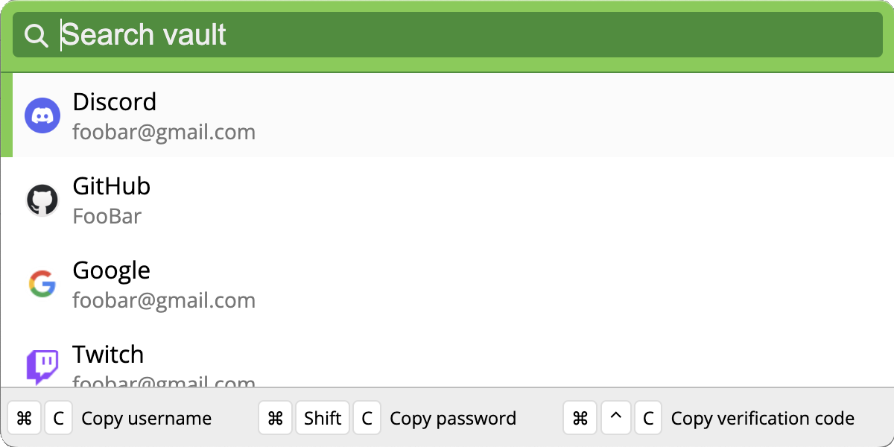

# Quickwarden
A companion utilty for the [Bitwarden](https://bitwarden.com) Desktop Client that creates a popup window to quickly copy usernames, passwords, and verification codes while inside any other app.

Inspired by 1Password's [Quick Access](https://support.1password.com/quick-access/) feature.

## Installation and Setup
1. Download the [Bitwarden CLI](https://bitwarden.com/help/cli/#download-and-install)
    - This is **separate from the Bitwarden client**.
    - I recommend downloading it via [npm](https://www.npmjs.com/package/@bitwarden/cli) or [Homebrew](https://formulae.brew.sh/formula/bitwarden-cli#default)
2. Download (or [build from source](#build-from-source)) the Quickwarden executable.
3. Login with your Bitwarden Account's API keys
    - Your API keys can be found on the Bitwarden website under `Account Settings -> Security -> Keys -> API Key`.
    - You can optionally have your API Keys saved in Electron's `localstorage` between restarts. (See [Security](#security))
    - You will always have to enter your Master Password between restarts.

### Usage
| Description | Keybind |
| - | - |
| Popup the Quickwarden Window | `Ctrl/Cmd + Shift + Space` |
| Close the Window | `Escape` |
| Search | Just start typing... |
| Move Selection Up/Down | `Up/Down Arrow`
| Copy Username | `Ctrl/Cmd + C` |
| Copy Password | `Ctrl/Cmd + Shift + C` |
| Copy Verification Code (TOTP) | `Ctrl + Alt + C` on Windows/Linux `Cmd + Ctrl + C` on MacOS |

### Build from Source
1. Clone the repository.
2. Run `npm i` to install all npm dependencies.
3. Run `npm run make` to build an executable.
4. The executable can be found in the `out/make/` directory.
    - e.g., on MacOS: `out/make/zip/darwin/arm64/Quickwarden-darwin-arm64-1.0.0.zip`

## Security
Your Bitwarden Account is likely the key to a lot of things in your life that you would like to keep very secure. For that reason, you **should not** give just any app your Bitwarden credentials without excersizing extreme caution.

Quickwarden is completely open source and will remain that way. I encourage everyone to read the source code themselves (I have attempted to make it as easy to read as possible) and [build from source](#build-from-source) to verify that your executable was created from the source that you read.

Quickwarden uses Bitwarden's API keys to login to the Bitwarden CLI. I chose to use API keys instead of a username because the Bitwarden CLI does not currently support some of Bitwarden's 2FA options, including the one I use. As far as I can tell, API keys are also more secure because they can be revoked by the user and still require the Master Password to login.

Quickwarden can optionally save your API keys in Electron's localstorage to make logging in between restarts faster. **Electron's localstorage is not encrypted.** Potentially a malicious application could scan for these keys. However, these keys are useless without the Master Password and the Master Password is never saved to disk. I am open to suggestions on how to better save these keys.

Your Master Password is the true key to your Bitwarden Account. For that reason, Quickwarden has been written to discard it as soon as it logs in.
1. When the "Log in" button is pressed, the login window calls the `loginWithApi()` function and passes it the Master Password.
    - https://github.com/Trikzon/quickwarden/blob/main/src/render/login/login.ts#L25
2. The `loginWithApi()` function first gets routed through IPC to immediately invoke the `loginWithApi()` function on the main thread.
    - https://github.com/Trikzon/quickwarden/blob/main/src/render/preload.ts#L18-L20
3. The IPC invocation is handled on the main thread and immediately calls the bitwarden API function `loginWithApi()`.
    - https://github.com/Trikzon/quickwarden/blob/main/src/main/ipc.ts#L10-L12
4. The bitwarden API function takes the Master Password and calls the Bitwarden CLI command `bw unlock --raw --passwordenv BW_PASSWORD` with `BW_PASSWORD` set to the Master Password.
    - https://github.com/Trikzon/quickwarden/blob/main/src/external/bitwarden/cli.ts#L23-L25
5. From then on, the program only uses the session ID that is created when unlocking the vault. This session ID is valid until `bw lock` is ran (upon a Quickwarden restart) and is also not saved to disk.

No other code touches the Master Password.

If you have further security concerns that I have not addressed here or have suggestions on how to make Quickwarden more secure, please create an issue or a pull request.
